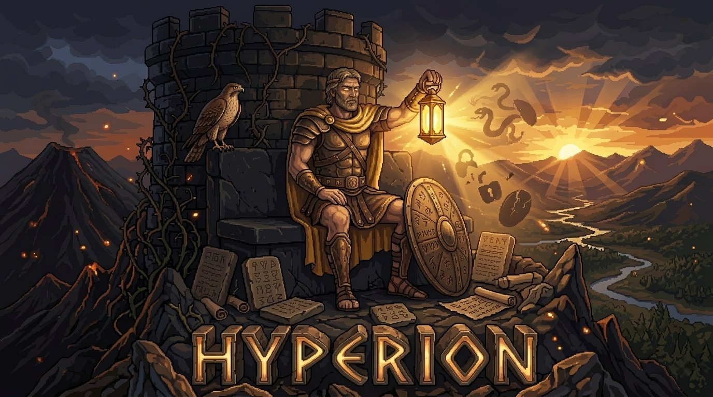

<p align="center">
  
</p>

<h1 align="center">Hyperion</h1>

<p align="center">
  <strong>Security Titan for Code and AI Agents</strong><br>
  Threat detection backed by 65 vulnerability patterns, 13 agent attack vectors, and 55 decision rules. Thinks like a threat actor. Fixes like an engineer.
</p>

<p align="center">
  <a href="LICENSE"></a>
  <a href="https://www.python.org/downloads/"></a>
  <a href="https://modelcontextprotocol.io"></a>
  <a href="https://ko-fi.com/rezraa"></a>
</p>

---

## Why

Security scanners find problems. Hyperion finds problems, tells you how an attacker would exploit them, gives you the exact fix code, and verifies the fix works.

Most tools also miss agent-specific threats entirely. Prompt injection, data exfiltration through tool calls, jailbreak, excessive agency. Traditional scanners don't know these exist. Hyperion hunts for them.

Named after the Titan of watchfulness, father of Helios the sun. Nothing hides in his light.

## Knowledge Base

Structured security knowledge, not vibes.

| Category | Count | What |
|----------|-------|------|
| Threat vectors | 65 | SQL injection, XSS, CSRF, SSRF, deserialization, path traversal, and more. Each with CWE, OWASP mapping, detection patterns, remediation code. |
| Agent threats | 13 | Direct/indirect prompt injection, data exfiltration, jailbreak, context poisoning, tool abuse, memory poisoning, insecure output, token exhaustion. |
| Security tools | 27 | SAST, DAST, SCA tool evaluations. Semgrep, Bandit, ESLint Security, OWASP ZAP, Snyk, Trivy. |
| Decision rules | 55 | Signal-to-threat mappings. "User input in SQL string" maps to injection. "JWT without signature check" maps to auth bypass. |

9 threat categories: injection, authentication, authorization, cryptographic, input validation, configuration, data exposure, supply chain, agent security.

## Tools

| Tool | What it does |
|------|-------------|
| `scan_code` | Pattern-based static analysis. Takes source code + language, returns CWE-classified findings with severity and evidence. |
| `assess_threat` | Threat modeling. Takes a system description + signals, returns attack vectors with risk scores. |
| `plan_remediation` | Fix code. Takes a finding, returns before/after code, verification steps, and testing recommendations. |
| `monitor_threat` | Incident response. Takes a threat type, returns a playbook with containment, monitoring queries, IOCs, and escalation. |
| `log_finding` | Records findings to the security log. Standalone: in-memory. Inside Othrys: writes to the shared graph. |

## Quick Start

### Install

```bash
git clone https://github.com/rezraa/hyperion.git
cd hyperion
python3 -m venv .venv && source .venv/bin/activate
pip install -e ".[dev]"
```

### Run Tests

```bash
pytest
# 35 tests, all passing
```

### Configure with Claude Code

Add to your project's `.mcp.json`:

```json
{
  "mcpServers": {
    "hyperion": {
      "command": "/path/to/hyperion/.venv/bin/python3",
      "args": ["-m", "hyperion.server"],
      "cwd": "/path/to/hyperion",
      "env": {
        "PYTHONPATH": "src"
      }
    }
  }
}
```

Then in Claude Code:

```
/scan review this auth implementation for vulnerabilities
```

### Dashboard

```bash
./start.sh
# Open http://127.0.0.1:8300
```

Dark theme security monitor. Findings appear in real-time, color-coded by severity: red (critical), orange (high), yellow (medium), blue (low).

## Architecture

```
Claude Code (top-level LLM) -> invokes /scan agent
  +-- Hyperion Agent (reasoning via persona + skill instructions)
       +-- Hyperion MCP Tools (scan, assess, remediate, monitor, log)
            +-- Knowledge Base (JSON)
                 |-- threat_vectors.json (65 patterns)
                 |-- agent_threats.json (13 patterns)
                 |-- security_tools.json (27 evaluations)
                 +-- decision_rules.json (55 rules)
```

Dual-mode: all tools accept an optional `conn` parameter. Without it, Hyperion runs standalone on local JSON. With it (inside Othrys), he reads from and writes to the shared Kuzu graph. Same logic, richer data.

## Project Structure

```
hyperion/
+-- src/hyperion/
|   |-- server.py          # MCP server
|   |-- tools/
|   |   |-- scan_code.py       # Static analysis
|   |   |-- assess_threat.py   # Threat modeling
|   |   |-- plan_remediation.py # Fix code generation
|   |   |-- monitor_threat.py  # Incident response
|   |   +-- log_finding.py     # Finding recorder
|   |-- knowledge/
|   |   |-- threat_vectors.json
|   |   |-- agent_threats.json
|   |   |-- security_tools.json
|   |   +-- decision_rules.json
|   +-- dashboard/         # Real-time security monitor
+-- .claude/
|   |-- agents/hyperion.md # Agent persona
|   +-- skills/scan/       # Skill workflow
+-- tests/
|   |-- test_tools.py      # Tool tests (35 total)
|   +-- test_knowledge.py  # Knowledge validation
+-- start.sh               # Dashboard launcher
+-- pyproject.toml
```

## Part of Othrys

Hyperion is one of seven Titans in the [Othrys](https://github.com/rezraa/othrys) summoning engine. Standalone, he scans code and models threats for any project. Inside Othrys, his findings feed into the shared graph and his threat patterns connect to architecture decisions (Coeus), test strategies (Themis), and project history (Phoebe).

## Support

If Hyperion is useful to your work, consider [buying me a coffee](https://ko-fi.com/rezraa).

## Author

**Reza Malik** | [GitHub](https://github.com/rezraa) | [Ko-fi](https://ko-fi.com/rezraa)

## License

Copyright (c) 2026 Reza Malik. [Apache 2.0](LICENSE)
